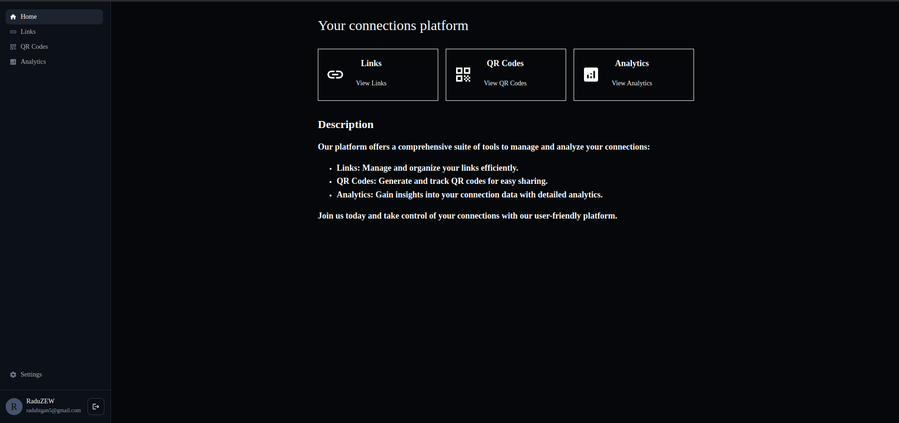
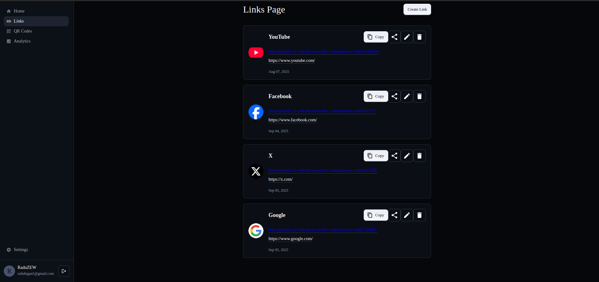
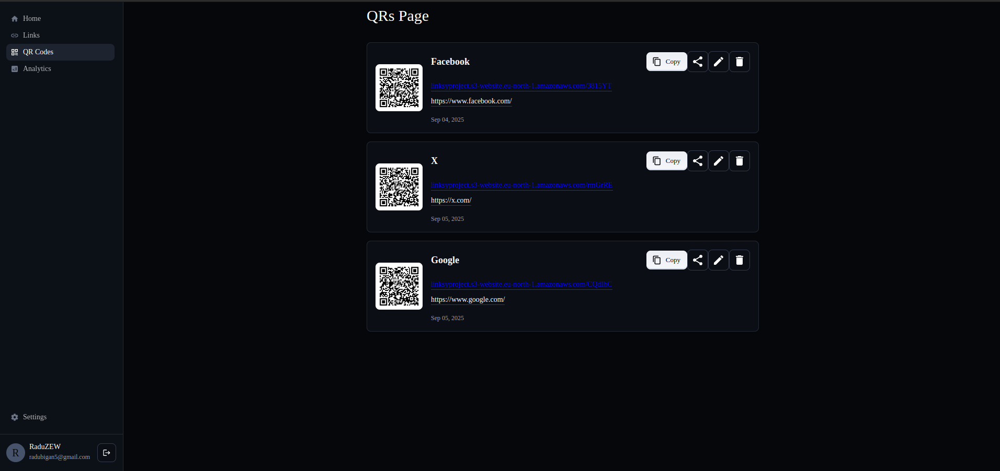
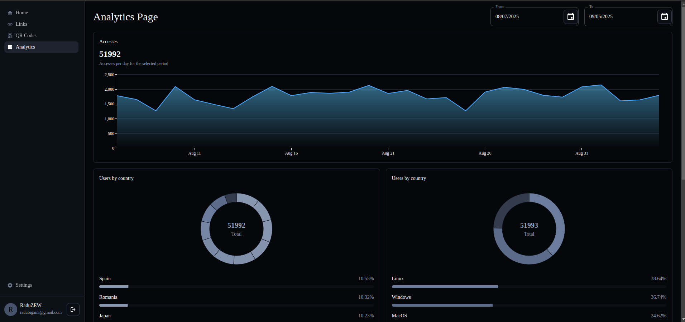
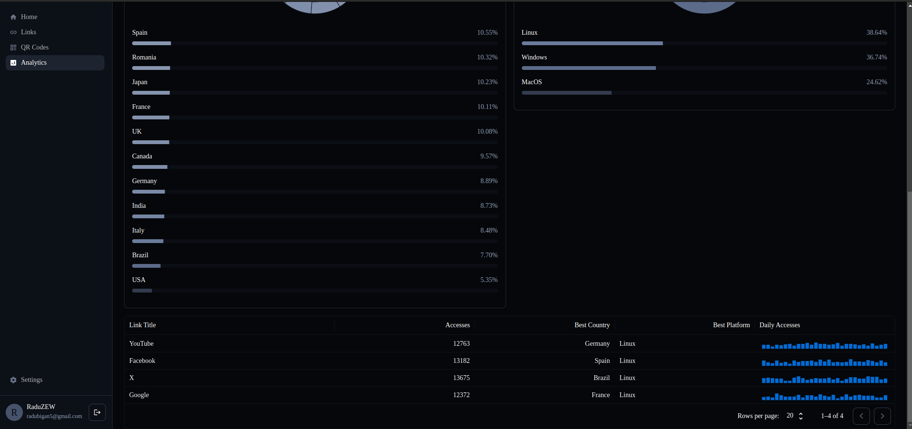
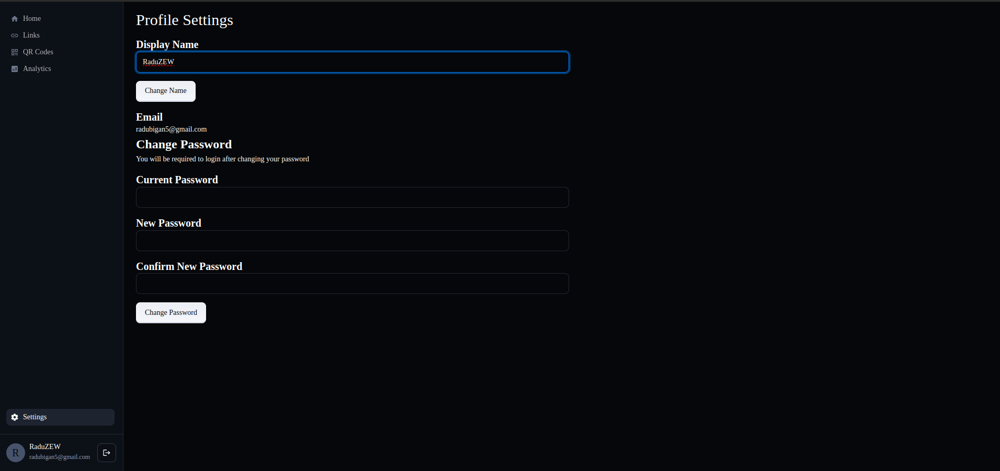
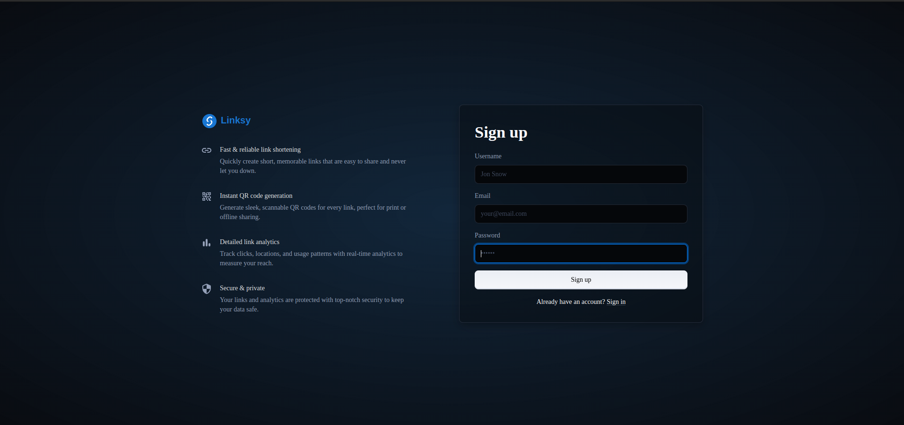
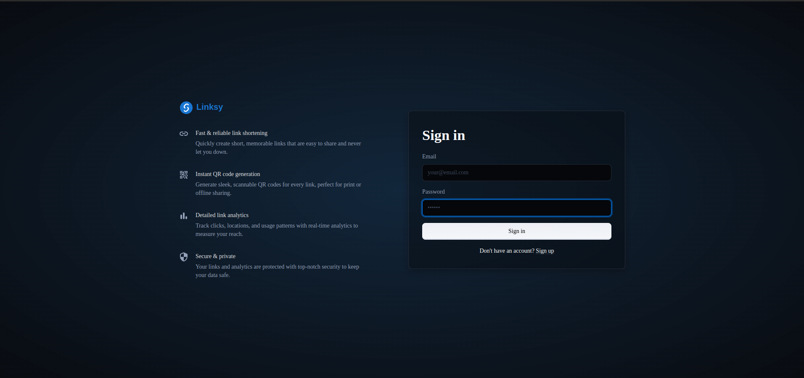

# 🔗 Linksy

Linksy is a modern **URL shortener with analytics and QR code support**.  
It allows you to create, manage, and analyze your shortened links with an intuitive web interface.

🌍 **Live Demo**: [Linksy Project](http://linksyproject.s3-website.eu-north-1.amazonaws.com/)

---

## ✨ Features

- 📌 **Main Page** – project overview and information  
  __

- 🔗 **Links Page** – view, create, edit, and delete links  
  __

- 🖼 **QR Codes Page** – automatically generated QR codes for your links, with images stored in AWS S3  
  __

- 📊 **Analytics Page** – in-depth statistics:
    - Daily accesses chart
    - Round charts for **countries** and **platforms**
    - Detailed table with per-link stats  
      __
      __

- ⚙️ **Settings Page** – update your account details (username, password)  
  __

- 👤 **Authentication** – sign-up and sign-in pages for account management  
  __
  __

---

## 🛠️ Tech Stack

**Backend**
- Language: [Go](https://go.dev/)
- Build System: [Bazel](https://bazel.build/)
- Database: [MongoDB](https://www.mongodb.com/)
- Hosting: [Render](https://render.com/)

**Frontend**
- Framework: [React](https://reactjs.org/)
- UI Components: [MUI](https://mui.com/)
- Hosting: [AWS S3](https://aws.amazon.com/s3/) (static hosting)

**Storage**
- QR code images are generated in the backend and stored in **AWS S3**

